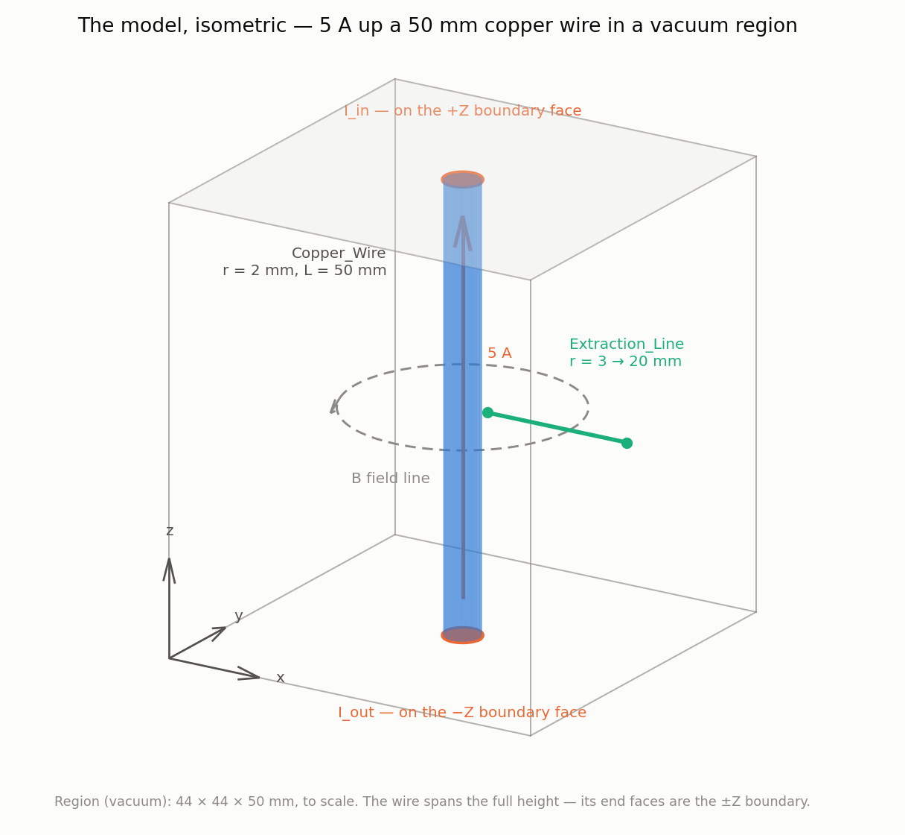
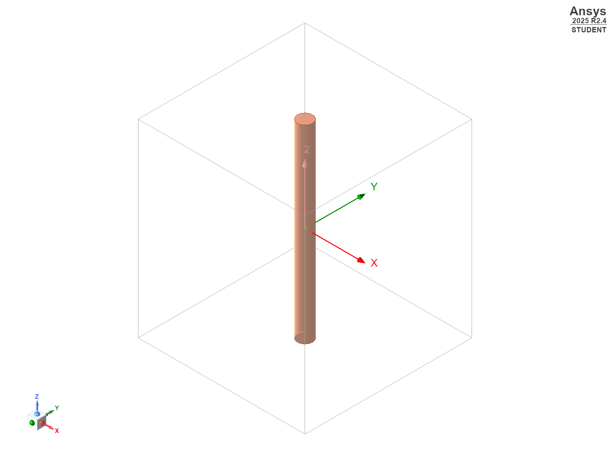
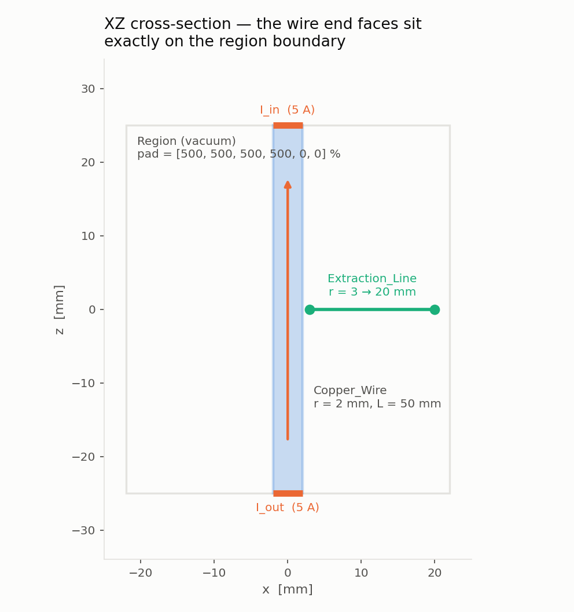
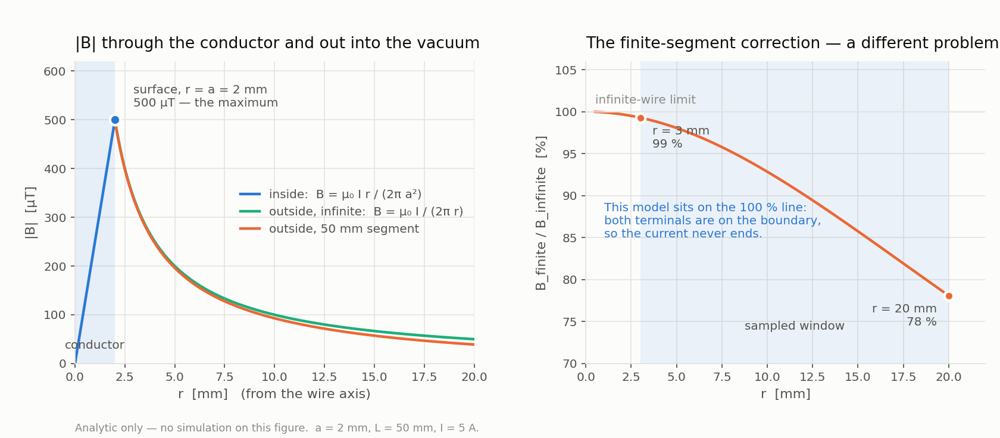
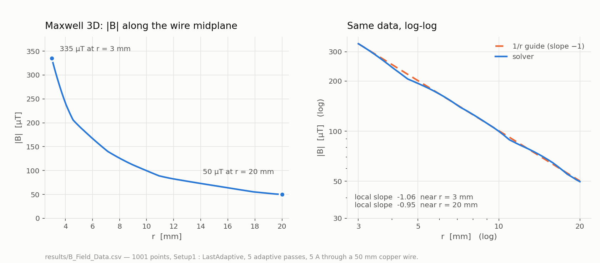
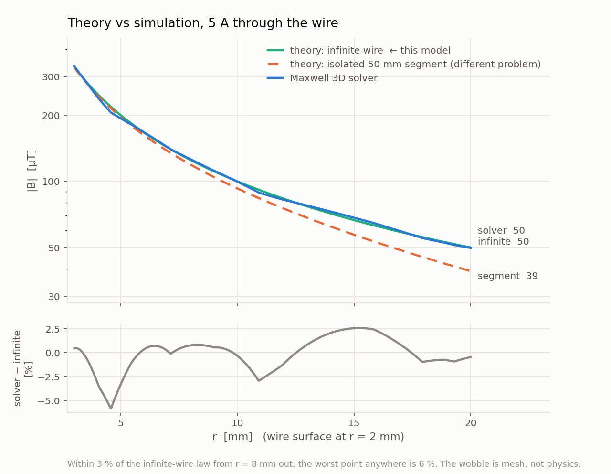
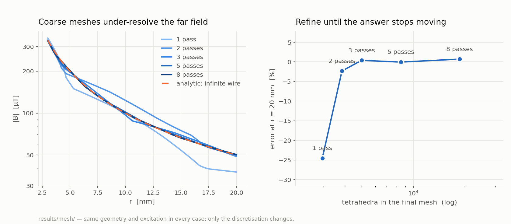
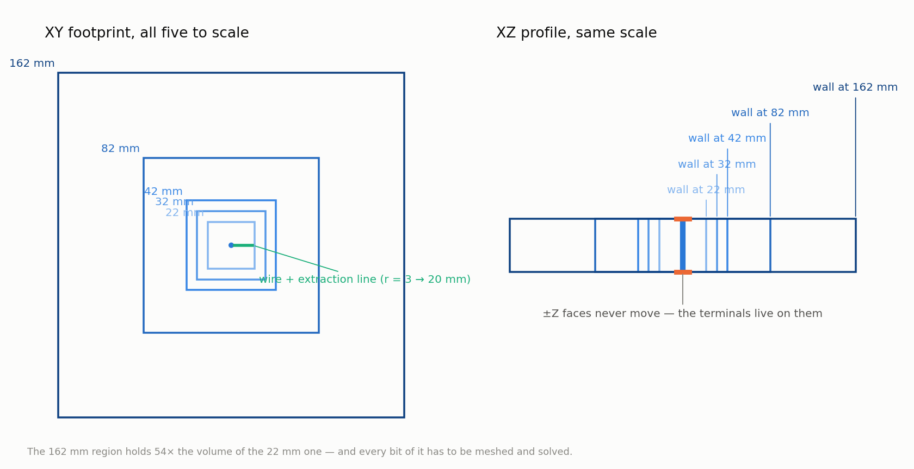
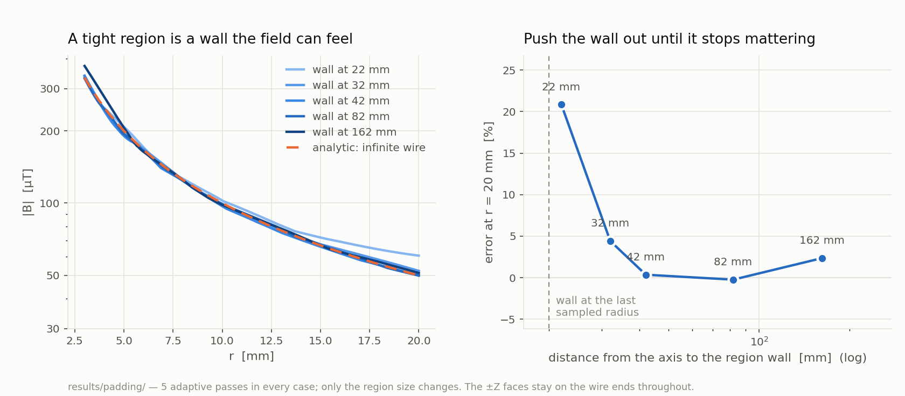

# Magnetostatics from scratch — a current-carrying wire in Ansys Maxwell 3D

One conductor, one current, one field. This repo takes the simplest problem in
magnetostatics all the way through a real finite-element solver, driven from
Python with PyAEDT, and then asks the two questions every FEA result has to
survive:

- does it match the theory?
- and how much of what I'm seeing is *the physics* versus *my discretisation
  and my boundary*?

Each of those gets its own script, its own data, and its own figure.

| | |
|---|---|
| [1. The model](#1-the-model) | what gets built, and why the region is shaped that way |
| [2. The theory](#2-the-theory) | Ampère's law inside and outside the conductor |
| [3. The simulation](#3-the-simulation) | what the solver returns |
| [4. Theory vs simulation](#4-theory-vs-simulation) | the validation, with a residual |
| [5. Effect of mesh refinement](#5-effect-of-mesh-refinement) | numerical error you can shrink |
| [6. Effect of the region padding](#6-effect-of-the-region-padding) | boundary error you can shrink |
| [Running it](#running-it) | setup, commands, files |

---

## 1. The model

A copper cylinder, r = 2 mm, L = 50 mm, along **Z**, carrying **5 A**, sitting
in a vacuum region. |B| is sampled along a straight line in the wire's
midplane, from r = 3 mm out to r = 20 mm.

<picture>
  <source media="(prefers-color-scheme: dark)" srcset="docs/images/isometric-dark.png">
  
</picture>

That is a schematic. Here is the same model in AEDT's own viewport, captured by
[`studies/capture_model_image.py`](studies/capture_model_image.py):

<p align="center">
  
</p>

Worth comparing the two. The screenshot proves the model is real and the
proportions are right; the schematic labels the terminals, the boundary faces
and the field, none of which AEDT draws for you.

The same thing from two orthogonal directions, with dimensions and the field
direction marked:

<picture>
  <source media="(prefers-color-scheme: dark)" srcset="docs/images/geometry-dark.png">
  
</picture>

| | |
|---|---|
| Solution type | Magnetostatic |
| Conductor | cylinder along Z, r = 2 mm, L = 50 mm, centered at the origin |
| Material | copper |
| Region | vacuum, walls at x, y = ±100 mm, z = ±25 mm, `pad_type = "Absolute Position"` |
| Excitation | `I_in` 5 A on the +Z end face; `I_out` 5 A on the −Z end face, `swap_direction=True` |
| Setup | `Setup1`, `MaximumPasses = 5` |
| Extraction | polyline (3, 0, 0) → (20, 0, 0) mm |

The right-hand view is the one to keep in your head: **B is azimuthal**. It
circles the current, it has no radial or axial component here, and the
extraction line is radial — so it cuts those circles at 90° and every sample is
pure B_φ. That is why a single scalar |B| versus r is the whole answer.

Two things in there are worth understanding rather than copying:

**The ±Z faces sit exactly on the wire's end faces.** A magnetostatic current
excitation is an *external terminal* — the face it sits on has to be on the
outer boundary of the problem, because that is where the current is understood
to come from and go to. Pad the region in Z and the wire floats inside it; both
terminals are then illegal and the solve stops.

This has a consequence people miss, and §2 is built on it: with both terminals
on the boundary the current never ends inside the domain, so **the model is an
infinitely long wire**, not a 50 mm segment — whatever length you drew.

**There are two current terminals, not one.** Current has to enter somewhere and
leave somewhere. A conduction path with a single terminal has nowhere to send
the 5 A, and the solver refuses it. `I_out` is the same 5 A with
`swap_direction=True`.

**The region is pinned, not padded.** `pad_type="Percentage Offset"` — the
obvious choice, and what this repo used at first — makes the Region
*parametric*: it tracks the model bounding box and re-evaluates whenever the
model changes. `Extraction_Line` reaches x = 20 mm, so the moment that line
exists the region silently grows from 44 × 44 × 50 mm to 242 × 44 × 50 mm,
off-centre in X. First run and second run then solve different problems.
`"Absolute Position"` fixes the walls where you put them. Verified both ways:
with absolute position the region's bounding box is unchanged after adding the
polyline; with percentage or absolute *offset* it is not.

The first two are modelling facts about magnetostatics. The third is an AEDT
behaviour, and it is the kind that silently changes your answer instead of
raising an error.

---

## 2. The theory

Before looking at any solver output, know what the answer should be. Everything
on this figure comes from Ampère's law and Biot–Savart — no simulation:

<picture>
  <source media="(prefers-color-scheme: dark)" srcset="docs/images/theory-dark.png">
  
</picture>

**Inside the conductor** (r < a), a circular Ampèrian loop encloses only the
fraction (r/a)² of the total current, so

```
B = μ₀·I·r / (2π·a²)          rising linearly from 0 on the axis
```

**Outside** (r > a) the loop encloses all of it:

```
B = μ₀·I / (2π·r)             falling as 1/r
```

so |B| peaks exactly at the conductor surface — 500 µT here — and there is no
field maximum anywhere else to look for.

**"But the wire is only 50 mm long"** — and this is the trap. For an *isolated*
straight segment of length L, on its midplane, Biot–Savart gives

```
B = μ₀·I·L / (2π·r·√(L² + 4r²))
```

the infinite result multiplied by `L / √(L² + 4r²)` — the right-hand panel
above. At r = 20 mm that factor is 78 %, a 22 % difference. So which law should
this model obey?

**The infinite one.** The length of the cylinder you drew does not decide it —
the boundary conditions do. Both current terminals sit *on* the region
boundary, so the current enters the domain at one face and leaves at the other.
It never stops in free space. There are no segment ends for the field to fall
off around, and the solver is modelling a wire that goes on forever.

That is not a guess; §4 measures it. Converged, the solver sits within ~2 % of
`μ₀I/(2πr)` and 22 % away from the segment formula.

> This repo argued the opposite until the numbers were checked. An early run
> matched the finite-segment curve to within a few percent — which looked like
> confirmation, and was actually an under-resolved mesh landing near the right
> answer to the wrong question. The 1-pass case in §5 still does exactly that:
> it reads 37.7 µT at r = 20 mm, close to the segment formula's 39 µT, and
> refining the mesh walks it to 50 µT. **Agreement with a formula is not
> evidence you picked the right formula.**

---

## 3. The simulation

What Maxwell 3D actually returns along the extraction line:

<picture>
  <source media="(prefers-color-scheme: dark)" srcset="docs/images/simulation-dark.png">
  
</picture>

335 µT at r = 3 mm down to 50 µT at r = 20 mm. The log–log panel is the useful
one: a pure 1/r field is a straight line of slope −1 there, and the solver's
local slope measures −1.06 near r = 3 mm and −0.95 near r = 20 mm. It is a 1/r
field to within the mesh noise — no steepening, no finite-length roll-off.

Raw data: [`results/B_Field_Data.csv`](results/B_Field_Data.csv), 1001 points,
semicolon-separated.

---

## 4. Theory vs simulation

<picture>
  <source media="(prefers-color-scheme: dark)" srcset="docs/images/theory_vs_simulation-dark.png">
  
</picture>

| r | Solver | Infinite wire ✅ | Isolated 50 mm segment |
|---|--------|------------------|------------------------|
| 3 mm | 335 µT | 333 µT | 331 µT |
| 20 mm | 49.8 µT | 50.0 µT | 39 µT ❌ |

At r = 3 mm the two laws are 0.7 % apart and the measurement cannot tell them
apart. At r = 20 mm they are 22 % apart and it can: the solver lands on the
infinite-wire value to better than half a percent.

Always plot the residual, not just the overlay — two curves on a log axis look
like they agree long after they stop agreeing. The residual here stays inside
±3 % from r = 8 mm out, and its wobble is mesh noise: it moves when you refine
the mesh (§5) and it does not move when you change the physics.

Getting to this figure took fixing two real bugs, both in §5 and §6's territory:
a region so tight the boundary was inflating the far field, and a mesh coarse
enough to fake agreement with the wrong law.

---

## 5. Effect of mesh refinement

FEA solves the field on a mesh of tetrahedra. Where the mesh is coarse relative
to how fast the field is changing, the answer is wrong — and at large r the
elements are big and |B| is small, so that is where it shows first.

The study solves the identical geometry and excitation with 1, 2, 3, 5 and 8
adaptive passes. Nothing physical changes between the cases; only the
discretisation does. So any movement in the answer is numerical error, and when
the answer *stops* moving you are mesh-converged.

Data committed at [`results/mesh/`](results/mesh/). Reproduce with:

```powershell
python studies/study_mesh.py        # 5 solves, one design each
python tools/plot_mesh_study.py
```

<picture>
  <source media="(prefers-color-scheme: dark)" srcset="docs/images/mesh_study-dark.png">
  
</picture>

| passes | tetrahedra | \|B\| at r = 20 mm | error |
|---|---|---|---|
| 1 | 2 948 | 37.7 µT | −24.6 % |
| 2 | 3 838 | 48.8 µT | −2.3 % |
| 3 | 4 996 | 50.2 µT | +0.4 % |
| 5 | 8 460 | 50.0 µT | −0.0 % |
| 8 | 18 611 | 50.4 µT | +0.7 % |

Converged by 3 passes, and 8 passes buys nothing but 18 000 elements. Note the
1-pass row: 37.7 µT is within 3 % of the isolated-segment formula's 39 µT. Stop
there and you would "confirm" the wrong physics — which is exactly what happened
in an earlier version of this repo.

Note that adaptive refinement is driven by the solver's own error estimate, so
`MaximumPasses` alone doesn't guarantee a finer mesh — AEDT stops early once it
thinks it has converged. The study pins `MinimumPasses` and tightens
`PercentError` so each case really does get the mesh its pass count implies.

---

## 6. Effect of the region padding

You cannot mesh infinity. The region is where free space gets truncated, and its
outer face carries a boundary condition. Put that face close and you are no
longer solving "a wire in free space" — you are solving "a wire in a box", and
the field nearest the wall is the most wrong.

The study puts the wall at 22, 32, 42, 82 and 162 mm from the axis, with the
mesh settings held fixed. Those five regions, to scale — no solver needed to
draw them:

<picture>
  <source media="(prefers-color-scheme: dark)" srcset="docs/images/region_sizes-dark.png">
  
</picture>

Note what does *not* change: the ±Z faces. Only the side walls move, because the
terminals have to stay on the top and bottom boundary. And note the price — the
162 mm region is 54× the volume of the 22 mm one, and all of it gets meshed and
solved.

Data committed at [`results/padding/`](results/padding/). Reproduce with:

```powershell
python studies/study_padding.py        # 5 solves, one design each
python tools/plot_padding_study.py
```

<picture>
  <source media="(prefers-color-scheme: dark)" srcset="docs/images/padding_study-dark.png">
  
</picture>

| wall at | \|B\| at r = 20 mm | error |
|---|---|---|
| 22 mm | 60.4 µT | +20.8 % |
| 32 mm | 52.2 µT | +4.4 % |
| 42 mm | 50.2 µT | +0.3 % |
| 82 mm | 49.9 µT | −0.2 % |
| 162 mm | 51.2 µT | +2.2 % |

A wall 2 mm past the last sample point inflates the field by 21 % — the boundary
squeezes the flux and |B| goes **up**. It is settled by 42 mm, about twice the
outermost radius sampled. The 162 mm case creeping back to +2 % is not the
boundary returning; it is the mesh, spread over 50× the volume at the same pass
count. Push the domain out far enough and you start paying for it in resolution.

The main model uses 100 mm.

Nothing below 500 % is usable here, and that is its own lesson: the region wall
would land at 18 mm while the extraction line runs out to 20 mm. Sampling a
field outside the solution domain doesn't give you a bad answer, it gives you a
meaningless one. **Size the region around what you intend to measure, not just
around the geometry.**

The ±Z padding stays 0 in every case — see section 1.

---

## Running it

| | |
|---|---|
| Ansys Electronics Desktop | **Student** 2025 R2 (build 2025.2.4) |
| Python | 3.12 (3.12.10 tested) |
| PyAEDT | 1.4.0 |

```powershell
py -3.12 -m venv .venv
.\.venv\Scripts\Activate.ps1
python -m pip install -r requirements.txt

python magnetic_field_wire.py          # the main solve, exports the CSV
```

Expected tail:

```
PyAEDT INFO: Design setup Setup1 solved correctly in 0.0h 0.0m 10.0s
Simulation complete. B-field data exported to: ...\B_Field_Data.csv
```

The figures are generated separately and need no AEDT at all — they read the
committed CSVs:

```powershell
python -m pip install -r requirements-plot.txt
python tools/plot_all.py               # every figure; skips studies with no data
```

### Layout

```
magnetic_field_wire.py            the main example, documented inline
studies/common.py                 shared model builder — all AEDT-side scripts
studies/capture_model_image.py    exports AEDT's own isometric viewport image
studies/study_mesh.py             sweeps adaptive passes      -> results/mesh/
studies/study_padding.py          sweeps region padding       -> results/padding/
tools/vizstyle.py                 shared plot style + the analytic formulas
tools/plot_isometric.py           §1  the model in 3D
tools/plot_geometry.py            §1  the model, XZ and XY views
tools/plot_theory.py              §2  analytic only
tools/plot_simulation.py          §3  solver only
tools/plot_theory_vs_simulation.py §4  the validation
tools/plot_mesh_study.py          §5  mesh convergence
tools/plot_region_sizes.py        §6  the five region sizes, to scale
tools/plot_padding_study.py       §6  boundary convergence
tools/plot_all.py                 all of the above
results/B_Field_Data.csv          main solver output (committed)
results/mesh/                     mesh study output, 5 cases + metadata
results/padding/                  region study output, 5 cases + metadata
docs/images/                      figures, light + dark variants
docs/TROUBLESHOOTING.md           every failure hit while building this, and its fix
```

### If it won't launch

The script opens with a three-line monkeypatch of `is_grpc_session_active()`.
PyAEDT 1.4.0 scans for `ansysedt.exe` only, never `ansysedtsv.exe`, so on the
Student build it cannot see the gRPC server it just started and fails with
`Failed to start new AEDT gRPC session on port ...`. Keep those lines. That and
every other failure — illegal external terminals, conduction paths, the 1.x API
renames — is diagnosed in
[`docs/TROUBLESHOOTING.md`](docs/TROUBLESHOOTING.md).
